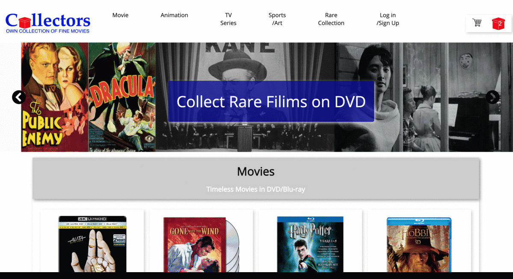

  

# Collectors-App

-  live site: https://collectors-react-redux-firebase-e-commerce-store-app.vercel.app/

---
## Technology

- React/Redux

- JavaScript ES6

- Google Firebase

- Stripe Payment

- Omniauth(Google)

- Redux Thunks

- modular SCSS

- Webpack

- HTML5

---
## Motivation

This application aims at E-Commerce web product which serve collectors of quality movies or various entertainment DVD/Blu-ray for their rare value.

Product category pages, checkout cart, and payment system, Log in /Sign up.

---

## Features

-  Reusable React components for Product Categories and User Log in / Sign up / Sign out

-  Redux global state management for product list and user status

-  Firebase Backend for User Authentification with Google Omniauth and product category/list

-  Stripe Payment integration for cart checkout system

- Memoization with Selectors for cart products or product categories

- State Normalization for large data set for performance enhancement

- Code Splitting to avoid winding up too big

- React Lazy and Suspense for dynamic import when it is needed

- Nested Routing to dynamically build routes with parent routes to their children

- HOC Patterns, a function that takes a component and returns a new component

- React Devtools Profiler

-  Asynchronous Thunks Middleware

-  Modular SCSS 

-  Responsive Flex and Grid Design

---

## Future Features to Come

- User profile pages
- Admin page
- Searching
- Amazon products API
- Detail product pages
---
## License ##
MIT © Justin K Lee
